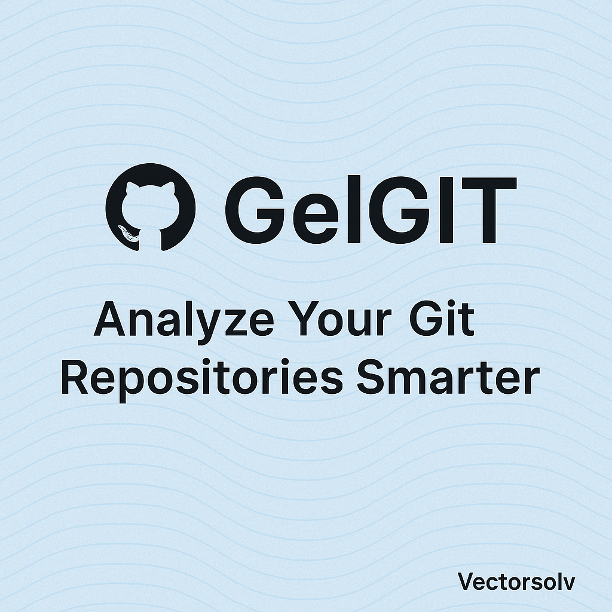
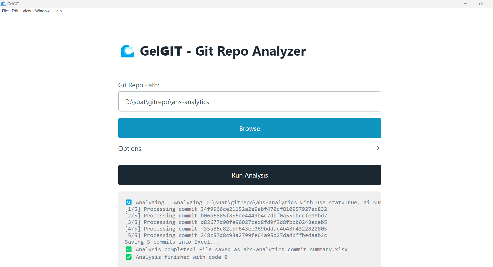
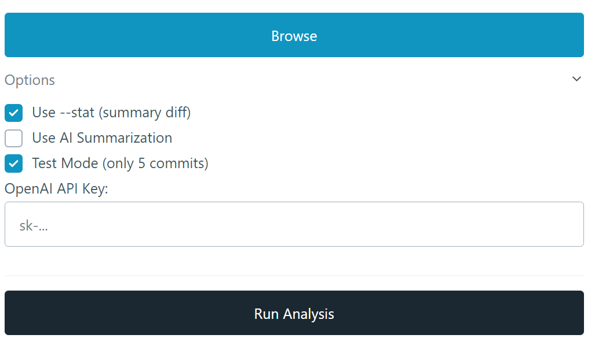

# GelGIT



[](https://github.com/vectorsolv/gelgit/releases/latest)


> An intelligent Git repository analyzer with AI-supported commit summarization.

**GelGIT** is a lightweight Electron.js and Python-powered desktop application that analyzes Git repositories, extracts commit histories, and optionally generates AI-driven summaries using OpenAI.

---

## ✨ Features

- 📂 Select any local Git repository
- 🔎 Analyze commit history and diffs
- ✍️ (Optional) Summarize commits using GPT-4
- 📊 Export results to Excel (.xlsx)
- 🖥️ Clean and modern user interface
- 🛠️ Easy to build as a standalone executable (.exe)

---

## 🚀 Getting Started

### 1. Clone the repository

```bash
git clone https://github.com/vectorsolv/gelgit.git
cd gelgit
```

### 2. Install Node.js dependencies

```bash
npm install
```

### 3. Install Python dependencies

Make sure **Python 3.8+** is installed.  
Then install the required Python packages:

```bash
pip install -r requirements.txt
```

### 4. Run locally (development mode)

```bash
npm start
```

✅ This will open the application for local testing.

---

## 🛠 Packaging the Application

### Important Note

Before proceeding with packaging, ensure that the latest version of **Python** (3.8+ or higher) is installed on your system.  
You can download it from the [official Python website](https://www.python.org/downloads/).  
After installation, verify the version using:

```bash
python --version
```

### Package a simple `.exe` (without installer)

```bash
npm run package
```
- Output: `/GelGIT-win32-x64/` folder containing `GelGIT.exe`

### Create a full Setup Installer (with installation wizard)

```bash
npm run dist
```
- Output: `/dist/` folder containing `GelGIT Setup 1.0.0.exe`

---

## 📋 Requirements

- **Node.js** (v18+ recommended)
- **Python** (3.8+ or higher)
- Python packages:
  - `openai`
  - `pandas`

You can easily install the Python requirements:

```bash
pip install -r requirements.txt
```

---

## 📸 Screenshots

### Main Dashboard



### Options



---

## 📜 License

This project is licensed under the [MIT License](LICENSE).  
Feel free to use, modify, and distribute it.

---

## 👨‍💻 Contributors

- Developed by the **Vectorsolv Team** with contributions from **Suat Atan** 💬

Pull requests are welcome!  
For major changes, please open an issue first to discuss your ideas.

---

## 🌐 About

Vectorsolv is a forward-thinking technology company specializing in intelligent software solutions.  
GelGIT is part of our ongoing efforts to simplify developer workflows with smart automation tools.

## ⚠️ Disclaimer

When using the AI-powered commit summarization feature, be aware that analyzing repositories with a large number of commits may consume a significant number of tokens, especially if using GPT-4. This could lead to higher API usage costs.  

To mitigate this, consider limiting the number of commits analyzed or summarizing only the most recent commits.

## 📝 Todo

- 🖼️ Add a splash screen during application startup.
- 👤 Include the author of each commit in the analysis.
- 📈 Add commit data visualization (e.g., graphs or charts).
- 📄 Consider implementing a repository summarizer feature.
- 🧪 Test and optimize performance for large repositories.
- 📦 Improve packaging options for cross-platform support.
- 🛡️ Enhance error handling and logging mechanisms.
- 🌐 Add localization support for multiple languages.
- 📚 Expand documentation with detailed usage examples.
- 🚀 Explore additional AI-powered features for repository insights.